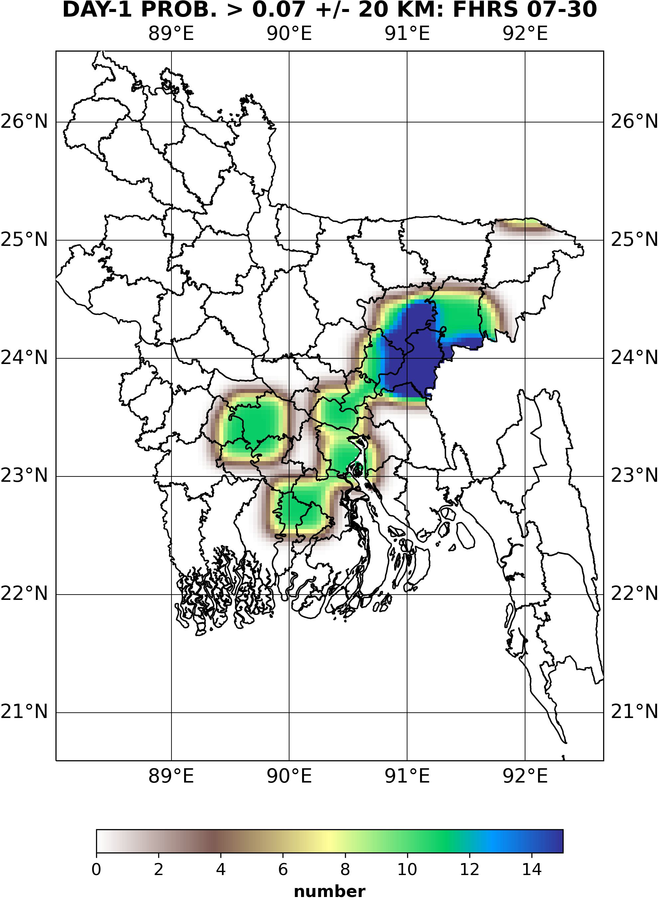
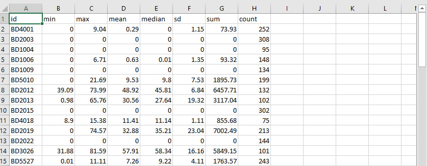

# Bangladesh Extreme Weather Alert

[](https://opensource.org/licenses/MIT)
[](https://servirglobal.net)
[](https://conda.io/)
[](https://www.python.org/)

This tool creates a CSV of Bangladesh extreme weather statistics for each feature in the configured shapefile
and a forecast map clipped to the boundary of the shapefile. These products are derived from the 
HIWAT model output by pointing the "data_path" in the configuration to the NetCDF.  The product will
be created for the current days date, so it needs to be run after the model is completed.  You can also 
pass in an argument when running the application to produce the data from (current day - n)
## Sample forecast outputs
### forecast map


### forecast CSV


## Setup and Installation
The installation described here will make use of conda to ensure there are no package conflicts with 
existing or future applications on the machine.  It is highly recommended using a dedicated environment 
for this application to avoid any issues.

### Recommended
Conda (To manage packages within the applications own environment)

### Environment
- Create the env

```shell
cd Bangladesh-Extreme-Weather-Alert
conda env create -f environment.yml
```

- enter the environment

```shell
conda activate bgd_ewa
```

- Create forecast definition file 
###### Note: If windows use copy instead of cp
```shell
cp forecast_definitions_example.json forecast_definitions.json
```

- Edit forecast_definitions.json

In your favorite text editor alter the variables in the forecast definitions file
to match your system.  The definitions are an array of forecasts, you may add as 
many or as few as you would like assuming that you have the appropriate data for each.
The forecast objects are defined as described in the following structure, you may 
also refer to the examples in the forecast_definitions_example.json.  
###### Note: If using on Windows: be sure to use double slashes in the paths ie: C:\\\hiwat\\\\{{YYYYMMdd}}12\\\hkhEnsemble_{{YYYYMMdd}}1200_day1_latlon.nc
```json
{
      "name": "", 
      "data_path": "",
      "data_variable": "",
      "shapefile_path": "",
      "output_prefix": "",
      "output_directory": ""
 }
```
name: This variable is for reference purposes, give each forecast a unique name to help identify them

data_path: The full path to your NetCDF file which is produced from the HIWAT model run.  Your files
will have the date in the name like "hkhEnsemble_202205051200_day1_latlon.nc", replace the date portion
20220505 with {{YYYYMMdd}} to make the variable "hkhEnsemble_{{YYYYMMdd}}1200_day1_latlon.nc".  You may also 
have the data in a directory with the same naming convention, simply do the same thing for this so 
change 2022050512/ in the path to {{YYYYMMdd}}12/

data_variable: The variable within the NetCDF you would like to use for the statistics and forecast map

shapefile_path: The full path to your shapefile that contains the features you want statistics for

output_prefix: A unique prefix for each forecast to avoid overwriting the outputs.  This will be used in the file naming.

output_directory: Full path to where you would like the output created. 

Along with the array of forecasts, there is a smtp_settings object which contains:

smtp: the smtp that you will use for sending the emails
name: the email address of the sending user
password: the password for the sending user

Finally, there is the email_list_xlsx key.  This key is where you set the name and full path to the location of the 
email list xlsx file.  Because you will be running the application with cron you will need the full path to the file.
Copy this xlsx file out of the project directory to avoid having it overwritten when you ```git pull``` to update 
this software in the future.  Enter the full path to the copied file in the forecast_definitions.json file. 

Now you can add email addresses to the xlsx file.  Remove the sample email addresses prior to adding.  
Be sure that you do not edit or remove the header "Email", 
simply add email addresses one per row in the Email column.  For testing, you may want to start with only a 
couple of addresses that you can confirm received the alerts.

- Test the application

To confirm that all the variables are correct and the application is set up properly you will want to do a test run.
To do this while in the bgd_ewa environment run the following.

```shell
python main.py
```

If you do not have data for the current day yet, the prior test will fail and let you know the files do not exist.
You can still test using prior data that has been output by passing in a delta value representing the number of days 
prior to today that you would like to run the application for.  This value that you pass should be an integer 
as seen in the following example where we run the forecast for the data ten days prior to today.

```shell
python main.py 10
```

- Set up cron to automate the production of the forecast products on linux
I recommend using the root cron, this is useful when working in a team where multiple may need to access or update 
the cron jobs.  It also helps to avoid and permission errors that could be caused by a specific user owning the data
or directory structure.
###### Note: For windows you will have to set up a task in Task Manager making sure to use full pathing as below

```shell
sudo crontab -e
```

Use the arrows to navigate to the bottom of this file then begin editing.  You will need the full path to your 
environments' python, the full path to the main.py file, and a full path to where you want log files to be written.
You will also need to decide when you would like to run the application.  With this information you can create the 
cron string to enter on the new line like:

```shell
0 16 * * * /home/username/conda/anaconda3/envs/bgd_ewa/bin/python /home/username/Bangladesh-Extreme-Weather-Alert/main.py >> /home/username/logs/bgd_ewa_`date +\%Y\%m\%d\%H\%M\%S`.log 2>&1
```

This example will run the application daily at 1600 hours, it doesn't pass in a delta day, so it will use the current
day as the file date, and it will output the log file to the log/ directory of the user "username".  You will need
to adjust these paths to fit your system structure and naming.

## Contact

### Authors

- [Billy Ashmall (NASA)](mailto:billy.ashmall@nasa.gov)

## License and Distribution

Bangladesh Extreme Weather Alert is distributed by SERVIR under the terms of the MIT License. See
[LICENSE](https://github.com/SERVIR/Bangladesh-Extreme-Weather-Alert/blob/master/LICENSE) in this directory for more information.

## Privacy & Terms of Use

Bangladesh Extreme Weather Alert Delivery abides to all of SERVIR's privacy and terms of use as described
at [https://servirglobal.net/Privacy-Terms-of-Use](https://servirglobal.net/Privacy-Terms-of-Use).